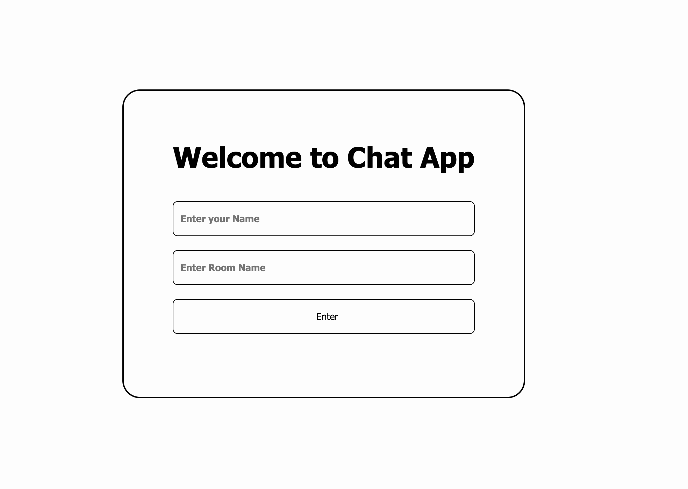

# Chat

## Table of contents
* [General info](#general-info)
* [Technologies](#technologies)
* [Setup](#setup)

<p align="center">
  
</p>

[DEMO](https://app-chatapp.herokuapp.com/)

## General info
A web based chat application where people can connect with each other: chat box, list of users, shared room.

## Technologies
Project is created with:
* Node.js
* JavaScript
* HTML & CSS3
* Web sockets

## Setup
To run a project, install it locally using node:

```
cd ../chat
npm install (or simplter and shorter npm i)
node start
```